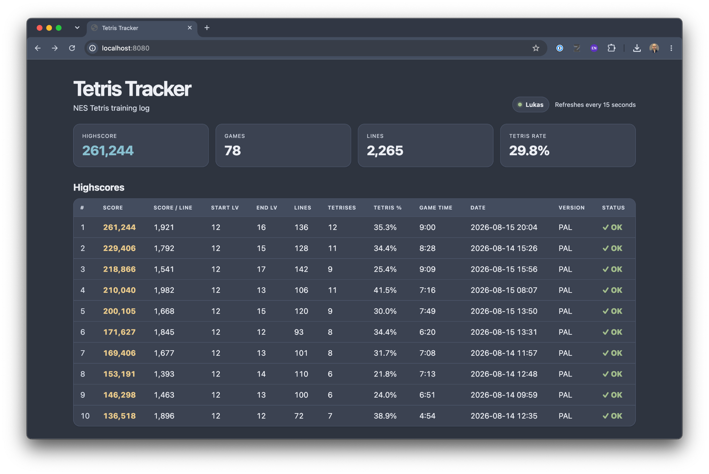
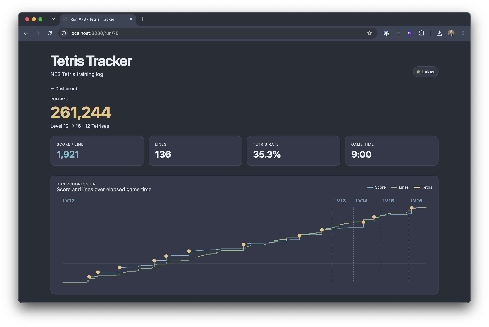

# Tetris Tracker

Tetris Tracker turns classic NES Tetris sessions into training data.

It runs alongside RetroArch, reads the game state through RetroArch Network Commands and automatically records your games while you play.

No modified ROM is required and there is nothing to enter manually.

**Just play Tetris.**

The tracker records data such as:

- score
- lines
- start and end level
- Tetrises
- Tetris rate
- game time
- gameplay events
- personal bests

A built-in web dashboard provides an overview of your training and detailed visualizations of individual runs.

## Screenshots

### Training dashboard

Overview of recorded games, personal bests and training statistics.



### Run details

Inspect individual games with score and line progression, Tetris events and level transitions over time.



## RetroPie installation

Tetris Tracker is designed to run directly on a Raspberry Pi alongside RetroPie and RetroArch.

### 1. Fix the legacy Raspberry Pi package repository

On older RetroPie installations the original Raspbian repository may no longer be available.

Replace it with the legacy repository:

```bash
sudo sed -i 's#raspbian.raspberrypi.org#legacy.raspbian.org#' /etc/apt/sources.list
```

Then update the package lists:

```bash
sudo apt-get update
```

Make sure Python, pip and Git are installed:

```bash
sudo apt-get install -y python3 python3-pip git
```

### 2. Update pip

RetroPie installations often ship with an older pip version.

Install a Python 3.7 compatible pip version for the current user:

```bash
python3 -m pip install --user --upgrade "pip<24.1"
```

Make sure the local Python binary directory is in your `PATH`:

```bash
export PATH="$HOME/.local/bin:$PATH"
```

You can add this line to `~/.bashrc` if necessary.

### 3. Clone Tetris Tracker

```bash
cd ~
git clone https://github.com/lukfor/tetris-tracker.git
cd tetris-tracker
```

Install it:

```bash
python3 -m pip install --user .
```

For development you can instead use an editable installation:

```bash
python3 -m pip install --user -e .
```

### 4. Enable RetroArch Network Commands

Tetris Tracker communicates with RetroArch through its Network Command interface.

Enable it in the RetroArch configuration:

```ini
network_cmd_enable = "true"
network_cmd_port = "55355"
```

The built-in NES collector uses `READ_CORE_MEMORY` to read the running game state.

### 5. Test the tracker

Start NES Tetris in RetroArch and run:

```bash
tetris-tracker \
    --db ~/tetris-tracker/tetris.db \
    --host 127.0.0.1 \
    --port 55355 \
    nes-retroarch
```

When gameplay starts, the tracker should display a RetroArch notification:

```text
Tetris Tracker: Tracking started
```

After a completed game the run is written to the SQLite database.

### 6. Test the web dashboard

In another terminal run:

```bash
tetris-tracker-web \
    --host 0.0.0.0 \
    --port 8080 \
    --db ~/tetris-tracker/tetris.db
```

On the Raspberry Pi itself the dashboard is available at:

```text
http://127.0.0.1:8080
```

From another device on the same network, use the Raspberry Pi's IP address:

```text
http://<RETROPIE-IP>:8080
```

For example:

```text
http://192.168.1.100:8080
```

## Start automatically with RetroPie

Once everything works manually, both the tracker and the web dashboard can be started automatically with RetroPie.

Edit:

```bash
nano /opt/retropie/configs/all/autostart.sh
```

Add the tracker before the normal EmulationStation startup:

```bash
$HOME/.local/bin/tetris-tracker \
    --db "$HOME/tetris-tracker/tetris.db" \
    --host 127.0.0.1 \
    --port 55355 \
    nes-retroarch \
    >> "$HOME/tetris-tracker/tracker.log" 2>&1 &
```

Start the web dashboard as a second background process:

```bash
$HOME/.local/bin/tetris-tracker-web \
    --host 0.0.0.0 \
    --port 8080 \
    --db "$HOME/tetris-tracker/tetris.db" \
    >> "$HOME/tetris-tracker/web.log" 2>&1 &
```

Keep the existing EmulationStation command as the final command in `autostart.sh`.

A typical configuration therefore looks like:

```bash
#!/bin/bash

$HOME/.local/bin/tetris-tracker \
    --db "$HOME/tetris-tracker/tetris.db" \
    --host 127.0.0.1 \
    --port 55355 \
    nes-retroarch \
    >> "$HOME/tetris-tracker/tracker.log" 2>&1 &

$HOME/.local/bin/tetris-tracker-web \
    --host 0.0.0.0 \
    --port 8080 \
    --db "$HOME/tetris-tracker/tetris.db" \
    >> "$HOME/tetris-tracker/web.log" 2>&1 &

emulationstation
```

After rebooting the Raspberry Pi, Tetris Tracker and its web dashboard should start automatically in the background.

## Updating

The repository already includes an `update.sh` script. To update Tetris Tracker, simply run:

```bash
cd ~/tetris-tracker
./update.sh
```

The script pulls the latest version and installs the updated package.

## Supported NES Tetris ROMs

The NES RetroArch collector deliberately only reads emulator memory when a
known Tetris ROM is running.

This prevents the tracker from interpreting arbitrary NES memory as Tetris
data when another game is loaded.

The currently supported ROMs are identified by their CRC32 checksum.

If a supported ROM is detected, RetroArch shows a message similar to:

```text
New game with CRC32 C99B0FCA inserted. Version pal detected.
```

For an unknown ROM, the tracker reports:

```text
New game with CRC32 XXXXXXXX inserted. Unsupported Tetris variant.
```

The same information is also printed to the tracker console:

```text
[rom] New game with CRC32 XXXXXXXX inserted. Unsupported Tetris variant.
```

When an unsupported ROM is detected, the collector returns no game state and
does **not** access emulator memory.

### My Tetris ROM is not recognized

Different legitimate releases or ROM dumps can have different CRC32
checksums.

If you are using Nintendo NES Tetris and the tracker reports:

```text
Unsupported Tetris variant.
```

look at the CRC32 shown in the message.

For example:

```text
New game with CRC32 ABCD1234 inserted. Unsupported Tetris variant.
```

Open:

```text
src/tetris_tracker/collectors/nes_retroarch.py
```

and find:

```python
KNOWN_TETRIS_ROMS = {
    "C99B0FCA": "pal",
    "D16EA396": "ntsc",
    "6D72C53A": "ntsc",
}
```

Add your ROM checksum with the correct version:

```python
KNOWN_TETRIS_ROMS = {
    "C99B0FCA": "pal",
    "D16EA396": "ntsc",
    "6D72C53A": "ntsc",
    "ABCD1234": "ntsc",
}
```

Use:

```text
"pal"
```

for the PAL version and:

```text
"ntsc"
```

for the NTSC version.

Then reinstall Tetris Tracker:

```bash
cd ~/tetris-tracker
python3 -m pip install --user .
```

or, if you are using the repository update script:

```bash
./update.sh
```

Restart the tracker afterwards.

### Important

Only add a CRC32 if you know that the ROM is a compatible Nintendo NES
Tetris version.

The tracker relies on specific NES Tetris RAM addresses. Adding the checksum
of an unrelated or incompatible ROM may cause incorrect game data to be
interpreted as Tetris state.

If you encounter another compatible NES Tetris release, please consider
opening an issue or pull request with its CRC32 and region so it can be added
to the supported ROM list.

## Other RetroArch systems

RetroPie is the easiest reference setup, but Tetris Tracker is not tied to RetroPie or Raspberry Pi.

It can also run on other Linux-based systems and handhelds where RetroArch is available, as long as:

- RetroArch Network Commands can be enabled
- the tracker can reach RetroArch's Network Command port
- Python can run on the device itself or on another machine on the network

This makes the same approach suitable for other RetroArch-based setups, including compatible retro handhelds and small Linux systems.

The currently built-in collector targets Nintendo NES Tetris. Support for additional games and platforms can be added through collectors.
